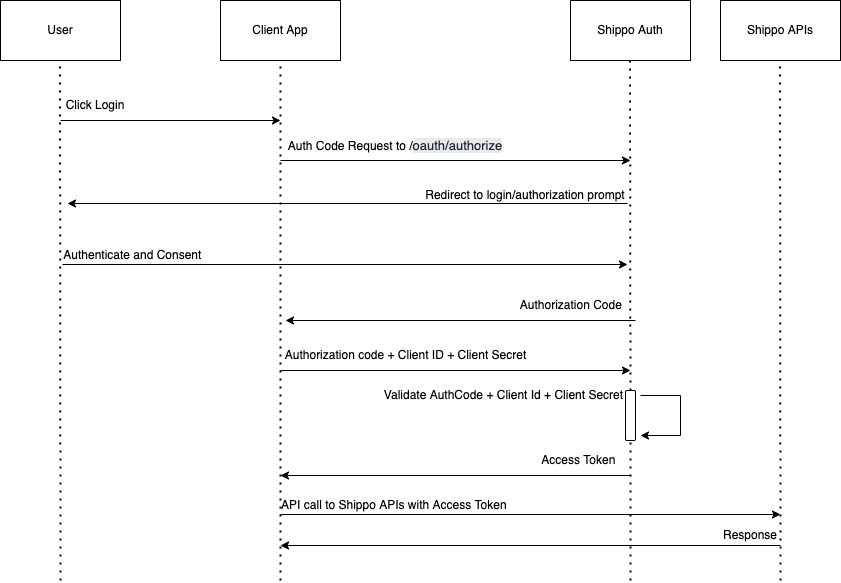
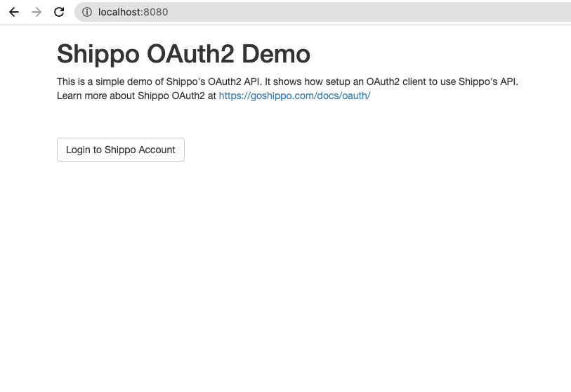
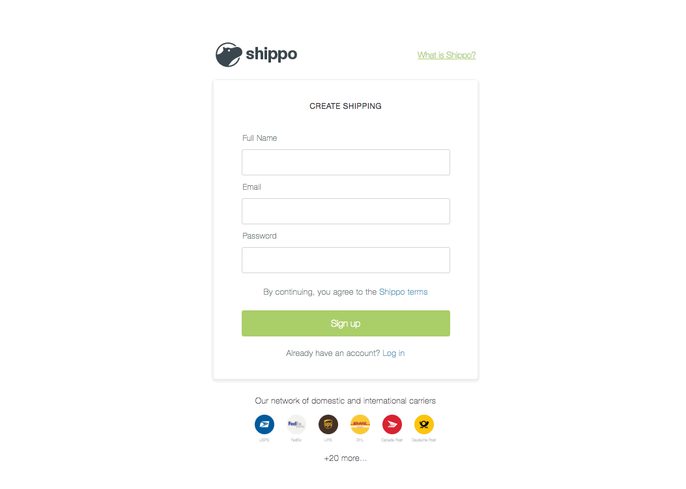

# Shippo OAuth Demo

## What is OAuth?

OAuth is an open-standard authorization protocol or framework that provides 
applications the ability for “secure designated access.” 

OAuth doesn’t share password data but instead uses authorization tokens 
to prove an identity between consumers and service providers. 
OAuth is an authentication protocol that allows you to approve one 
application interacting with another on your behalf without giving away your password.

## What is Authorization Code Flow?

Authorization code flow is used to obtain an access token to authorize API requests. Authorization code flow is the most flexible of the three supported authorization flows and is the recommended method of obtaining an access token for the API. This authorization flow is best suited to applications that have access to secure, private storage such as web applications deployed on a server. Other authorization flows are available to obtain an access token that may be suitable for your application.

Access tokens, obtained using authorization code flow, provide permissions for your application to manipulate documents and other resources on behalf of a Shippo user and make requests for all API resources.

Your application should warn users they will be asked to authorize using their Shippo account before initiating an action that requires authorization because users' web browsers will redirect to another site.

Remember, your application must be registered with the API to generate the client Client ID, Client Secret and redirection URL used in the authorization code flow.

## How does Shippo oAuth works?

## Screenshots

### Login Page

### Shippo Authentication and Authorization Page

## OAuth demos in multiple languages

## [Javascript](https://github.com/goshippo/shippo-demos-oauth/tree/main/javascript)

